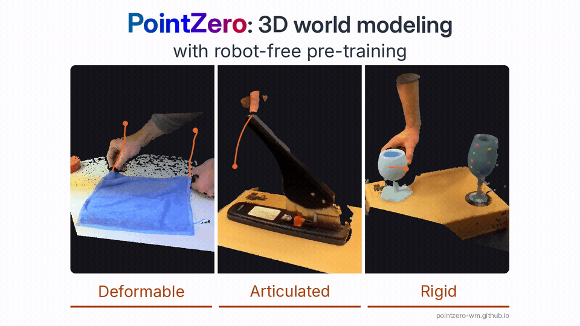

# PointZero

**3D Point Track Completion for Learning Transferable 3D Dynamics**

[Website](https://pointzero-wm.github.io/) · [Paper](https://arxiv.org/abs/2609.19142)

This repository will host the PointZero code. Release coming soon.
